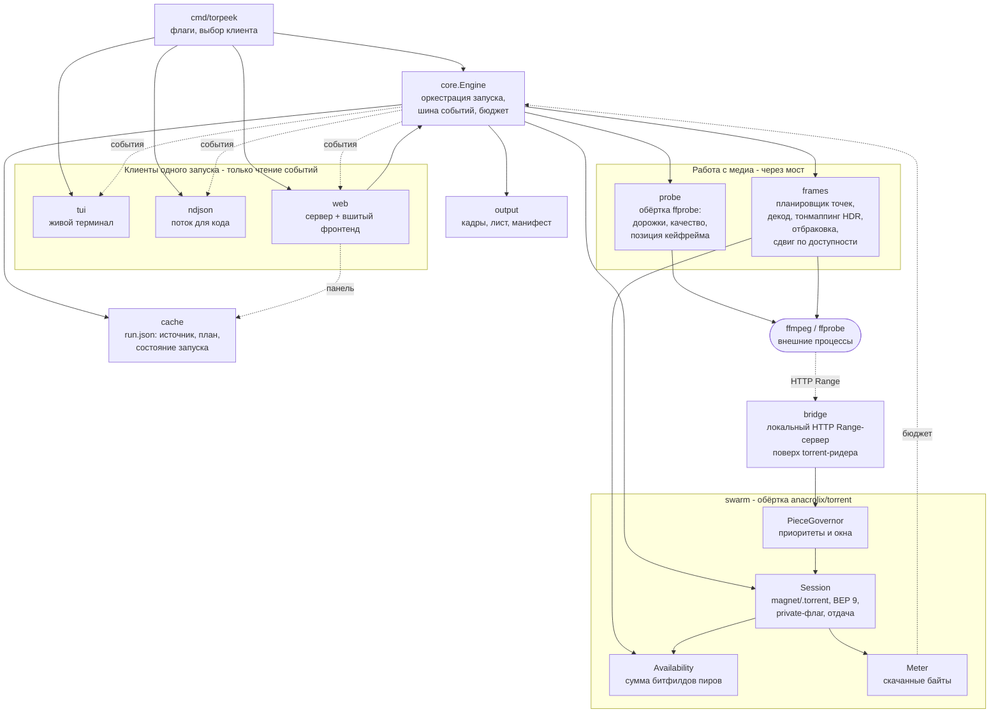
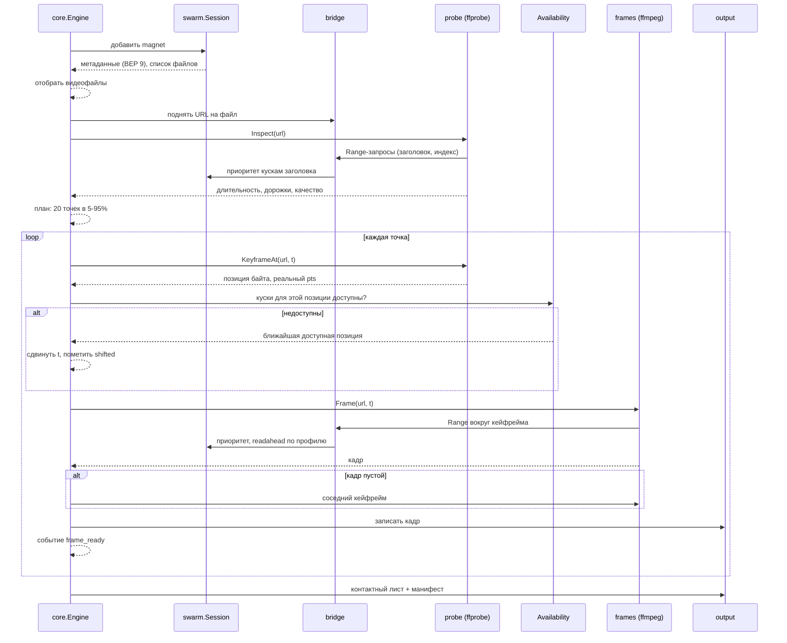
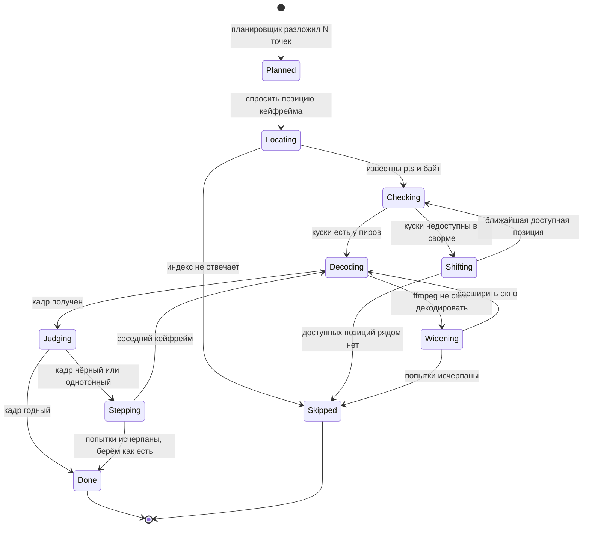

# torpeek — архитектура

Дополняет [REQUIREMENTS.md](REQUIREMENTS.md): там зафиксировано *что* система делает,
здесь — *как* она устроена. Стек (Go + `anacrolix/torrent`) выбран в §6 требований.

## Контекст и задача

Достать N кадров из середины видеофайла, лежащего в торренте, не скачивая файл. Две
независимые механики, которые надо соединить: BitTorrent умеет отдавать произвольные куски,
а контейнер видео знает, какому таймкоду какой байт соответствует.

## Ключевое решение: контейнер разбирает ffprobe, а не мы

Изначально предполагалось написать парсеры MP4 `moov`, MKV `Cues` и AVI `idx1`. Проверка
показала, что это не нужно: `ffprobe` по запросу отдаёт **байтовую позицию** кейфрейма для
нужного момента времени —

```
$ ffprobe -select_streams v -show_entries packet=pts_time,pos,flags \
          -read_intervals 30%+#3 -of csv probe.mp4
packet,30.000000,234624,K__      # t=30.0s → байт 234624, keyframe
```

а `ffmpeg` умеет `http`/`https` и запрашивает диапазоны сам. Значит достаточно показать ему
файл по HTTP — и разбор контейнера, поиск индекса (включая `moov` в хвосте) и выбор
кейфрейма достаются бесплатно, для **всех** контейнеров, которые знает ffmpeg, а не для трёх.

**Цена решения:** какие именно байты читать, решает ffmpeg, а не мы. Управление трафиком
становится косвенным: мы ограничиваем его через `-probesize`/`-analyzeduration`, узкий
readahead и приоритеты кусков, но теоретического минимума не гарантируем. Если замеры не
уложатся в критерий «≤60 МБ в min-traffic» (§8.2 требований), точечный парсер под конкретный
контейнер остаётся открытой дверью — но пишется он тогда, когда доказан, а не заранее.

## Компоненты



Кто чем владеет:

- **`core`** — единственный, кто знает про запуск целиком: последовательность шагов, общий
  бюджет, параллелизм по файлам, отмена. Ничего не печатает (§3.1).
- **`bridge`** — переводит HTTP-запросы ffmpeg в чтения из торрента. Живёт ровно столько,
  сколько запуск; слушает `127.0.0.1` на порту из конфига (не случайном — §4.1).
- **`swarm`** — вся работа с anacrolix: сессия, приоритеты, доступность, счётчик байт.
  Единственное место, где импортируется `anacrolix/torrent`.
- **`probe` / `frames`** — единственные, кто запускает внешние процессы.
- **`output`** — пишет кадры, лист и манифест каждого файла; `core` пишет рядом `run.json`
  через `cache` (не через `output`) — это состояние всего запуска, а не одного файла.
- **`tui` / `ndjson`** — только читают события одного запуска, логики не содержат.
- **`web`** — не только клиент одного запуска: держит реестр всех запусков процесса
  (`internal/web`), очередь на один слот перед `core.Engine` (§3.3 требований) и склеивает
  для панели живые запуски с находками `cache`/`output` на диске. Это единственный клиент,
  у которого есть собственная логика, а не только чтение событий.

## Поток данных



Существенная деталь: `KeyframeAt` вызывается **до** проверки доступности, а декод — после.
Позиция берётся из уже скачанного индекса и стоит почти ничего, а решение «сдвигаться или
нет» принимается до того, как потрачен трафик на само окно кадра.

## Жизненный цикл точки съёмки

Каждая из 20 точек проходит собственный автомат — здесь живёт вся логика сдвигов, из-за
которой набор кадров получается полным даже на дырявой раздаче:



Два разных сдвига, которые легко перепутать: **Shifting** — про сеть (куска нет у пиров,
двигаемся к доступному), **Stepping** — про картинку (кадр чёрный, двигаемся к соседнему
кейфрейму). Первый случается до траты трафика, второй — после. В манифест попадают оба,
но помечаются по-разному: `shifted` против `stepped`.

**Цвет решается один раз на файл, до первой точки.** HDR-источник, декодированный как SDR,
даёт плоский серый кадр — и единственное доступное человеку объяснение будет «torpeek
сломан», а не «это HDR» (TOR-108). Поэтому после `probe.Inspect` по трём тегам потока
(`color_transfer`, `color_primaries`, `color_space`) и записи Dolby Vision выбирается
преобразование, и оно уезжает в `-vf` того же вызова ffmpeg, который уже декодирует кадр —
отдельного прохода нет. Решение живёт в `internal/frames/hdr.go`; фильтры (`zscale`,
`tonemap`, `format`) есть во всех четырёх сборках, `libplacebo` сознательно не берём — он
есть в LGPL-сборках и отсутствует в GPL-сборке под macOS, то есть картинка стала бы
разной по платформам (docs/licensing.md).

Из этого следуют две вещи для схемы выше. **Judging судит уже преобразованный кадр** — то
есть отбраковка по разбросу яркости (§2.3) видит правильную картинку, а не расплющенную;
измерено, что нетронутый HDR-кадр порог всё равно не пробивал, но запас был вчетверо
меньше, чем у настоящей тёмной сцены. И **Dolby Vision профилей 4 и 5 мы не преобразуем**:
их базовый слой — IPT-PQ-c2, применить RPU нечем, поэтому запуск честно называет источник
в манифесте (`dynamic_range`) вместо того чтобы испортить кадр в новую сторону.

## Что и зачем скачивается

Ответ на главный вопрос — почему это дешевле, чем качать файл:

```
файл 10 ГБ
|-[ заголовок ]---------------------------------------------[ хвост ]-|
   moov / EBML                                              moov, если
   несколько МБ                                             без faststart
        |                                                        |
        +----- ffprobe: длительность, дорожки, качество ----------+

   20 окон вокруг кейфреймов, по одному на точку съёмки:
   [##]    [##]    [##]    [##]    [##]    [##]    [##]    [##]
---------------------------------------------------------------------
   5%                                                          95%

   каждое окно = 1-2 куска (кусок обычно 1-16 МБ)
   итого: заголовок + хвост + 20 окон ~ 50-150 МБ вместо 10 ГБ
```

Гранулярность задаёт торрент, а не мы: минимальная единица обмена — кусок, поэтому кадр
весом 200 КБ стоит как минимум один кусок. Отсюда и оценка в §7 требований, и то, почему
`min-traffic` экономит десятки процентов, а не порядки.

## Интерфейсы

Контракты между пакетами — достаточно конкретные, чтобы писать реализацию:

```go
// core: наружу — только события
type Event interface{ event() }

type MetadataReady struct{ Name string; Files []FileInfo }
type FileStarted   struct{ File int; Duration time.Duration; Media MediaInfo }
type FrameReady    struct{ File, Index int; Requested, Actual time.Duration; Path string; Shifted bool }
type BudgetWarning struct{ SpentBytes int64; LimitBytes int64; Elapsed, Limit time.Duration }
type FileDone      struct{ File int; Manifest string; Sheet string }
type Done          struct{ Reason StopReason } // completed | budget | cancelled
type Failed        struct{ Code ErrorCode; File int; Err error }

type Engine interface {
    Run(ctx context.Context, spec RunSpec) (<-chan Event, error)
}

// swarm: единственное место, знающее про anacrolix
type Session interface {
    Add(ctx context.Context, src Source) (Torrent, error)
    Close() error
}

type Torrent interface {
    Files() []FileInfo
    Reader(file int, profile Profile) io.ReadSeekCloser // profile задаёт readahead
    Availability() Availability
    Downloaded() int64
    Private() bool
}

type Availability interface {
    AtByte(file int, off int64) int              // сколько пиров держат этот кусок
    NearestAvailable(file int, off int64) int64  // ближайшее доступное смещение
    Map(file int, buckets int) []int             // для манифеста и TUI
}

// bridge: показывает файл торрента как обычный HTTP-ресурс
type Bridge interface {
    Publish(t Torrent, file int, profile Profile) (url string, release func())
}

// probe: обёртка ffprobe
type Prober interface {
    Inspect(url string) (MediaInfo, error)                    // длительность, дорожки, качество
    KeyframeAt(url string, at time.Duration) (Keyframe, error) // pts + байтовая позиция
}

// frames
type Extractor interface {
    Frame(url string, at time.Duration) (data []byte, actual time.Duration, err error)
}
```

`Profile` — то, чем различаются `min-time` и `min-traffic`: размер readahead, ширина окна
вокруг кейфрейма, `probesize`/`analyzeduration` для ffmpeg, число параллельных чтений.
Один тип, две константы — вместо двух веток кода по всему конвейеру.

## Данные на диске

```
<cache>/<infohash>/<paramsHash>/
├── run.json                    # источник (magnet/путь), план в читаемом виде,
│                                # список видеофайлов раздачи и какие из них полные
├── <file-slug>/
│   ├── frames/000.jpg …        # кадры, оригинальное разрешение
│   ├── sheet.jpg               # контактный лист
│   └── manifest.json           # §2.8 требований
```

`run.json` — источник истины для возобновления, кеша и панели раздач (§3.3 требований):
полностью готовый набор означает попадание в кеш и ноль сетевых запросов при повторном
запуске с теми же параметрами; тот же файл даёт панели название раздачи, источник и число
готовых файлов без обращения к сети, даже после перезапуска процесса — обходом
`<cache>/*/*/run.json` (`internal/web/listing.go`). Источник записывается как строка,
которую можно вставить обратно (magnet-ссылка или путь к `.torrent`), план — в терминах,
которыми его задавали (число кадров, окно, профиль), а не хешем `paramsHash`, который
обратно не разворачивается. `paramsHash` покрывает только те параметры, которые меняют
результат (число точек, окно, профиль), но не бюджеты и не параллелизм.

`manifest.json` описывает сам себя: путь кадра записывается относительно каталога самого
манифеста (`frames/000.jpg`), а не абсолютным путём, который был у кадра в момент съёмки.
Дерево результатов поэтому можно перенести, скопировать, положить в бэкап или забрать с
сидбокса на ноутбук (§4.1 требований) — оно откроется из того каталога, в котором его
нашли. Преобразование живёт ровно в двух местах: `cache.LoadManifest` — единственный, кто
читает манифест, знает каталог, из которого прочитал, и отдаёт наружу уже открываемые
пути; `output.Writer.WriteManifest` — единственный, кто пишет, и он же делает путь
относительным. Всё остальное (`core`, `internal/web`, `sheet.Build`) про две формы не
знает вовсе. Манифесты прежних версий с абсолютными путями читаются по-прежнему: кадр
сначала ищется внутри каталога самого манифеста и только потом там, куда указывает старая
запись, — так что копия никогда не отдаёт кадры оригинала, а версия формата не поднимается
(поднятая версия молча превратила бы все манифесты на дисках в промах).

## Отказы и деградация

| Что случилось | Поведение |
|---|---|
| Метаданные не пришли за таймаут | `Failed{no_metadata}`, ничего не скачано |
| Ноль пиров | `Failed{no_peers}` с числом сидов из трекера |
| Куски точки недоступны | сдвиг к ближайшему доступному, пометка `shifted` (§2.3) |
| Весь файл недоступен | файл пропускается, остальные обрабатываются |
| ffprobe не определил длительность | `Failed{unprobeable}`; с флагом — последовательный режим (§2.7) |
| ffmpeg упал на точке | повтор с расширенным окном, затем точка помечается пропущенной |
| Запрос к мосту не дождался кусков | таймаут запроса, чтобы ffmpeg не висел вечно; сам факт таймаута мост запоминает |
| Чтение через мост оборвалось по таймауту | `read_stalled`, а не `unprobeable`: ffprobe судит о файле, который недочитал, и его вердикт («нет длительности», «нет ключевого кадра с позицией») ничем не отличается от настоящей поломки контейнера. Знает об обрыве только мост, поэтому код берётся оттуда, и последовательный режим (§2.7) такой ошибкой не открывается |
| Бюджет исчерпан | корректная остановка, готовое сохранено, причина в манифесте (§2.6) |
| Отмена | то же самое; `run.json` позволяет добрать остаток (§2.10) |

Мост — единственное место, где чужой процесс может подвесить наш: у каждого запроса свой
таймаут и свой контекст, отменяемый вместе с запуском.

## Риски

1. **ffmpeg читает больше, чем нужно.** Главный риск выбранного подхода. Митигация:
   `-probesize`/`-analyzeduration`, `-ss` перед `-i` (быстрый seek), узкий readahead.
   Проверяется замером против критерия §8.2 — до того, как писать что-то поверх.
2. **Порт моста.** На управляемом хостинге (§4.1) даже localhost-порт должен быть из
   выделенного диапазона — значит порт моста настраиваемый, а не случайный.
3. **Порты BitTorrent — набор, а не порт.** Порт принадлежит клиенту anacrolix (TCP, uTP
   и DHT одного клиента — один порт), а приватная раздача не может делить клиент с
   публичной. Значит клиентов больше одного, портов тоже, и раздавать их должен кто-то
   один: `swarm.PortPool` — единственный на процесс, живёт в `swarm` рядом с самим
   клиентом. Кончились порты — `swarm.ErrNoPortAvailable`, а не тихий случайный порт
   вне диапазона (§4.1).
4. **Приоритеты вместо дедлайнов.** У anacrolix нет piece deadline: точка, ждущая редкий
   кусок, может задержать соседние. Митигация — таймаут на точку и сдвиг.
5. **Параллелизм по файлам множит процессы ffmpeg.** На shared-слоте это бьёт по CPU
   и IO соседей; дефолт там 1–2 (§4.1).
